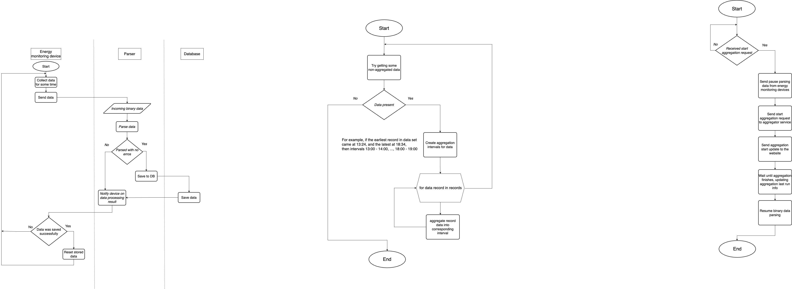

This mediator app is a part of [energokodros](https://senyehor.github.io/energokodros_website) system. 
It is responsible for communication between website, aggregator service and parsing service.
The main goal it was developed is to suspend parsing data while aggregation is running, as it would lead to
endless cycle, some new data will always come when an aggregation iteration is run. But it also serves as an
intermediate interface, separation communication and management logic.

